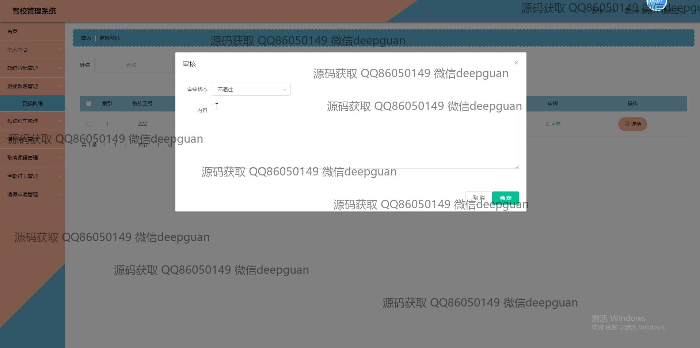
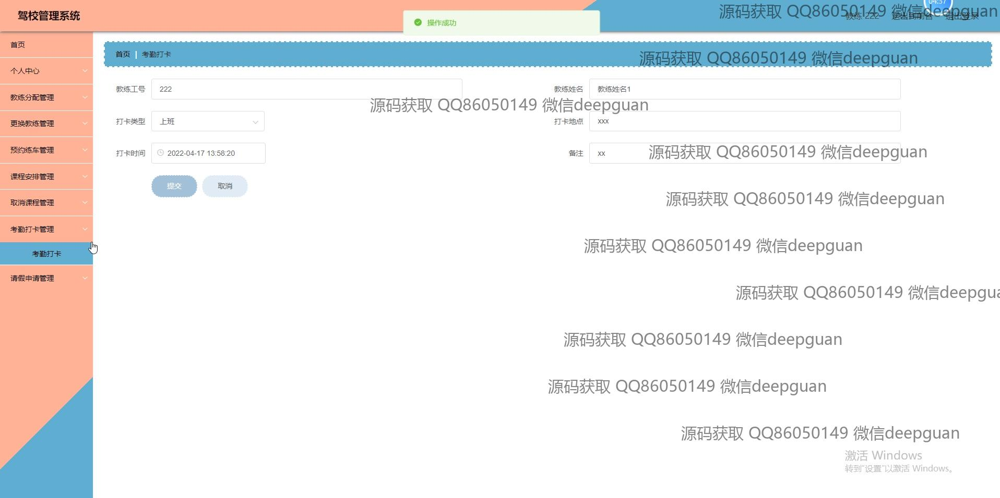
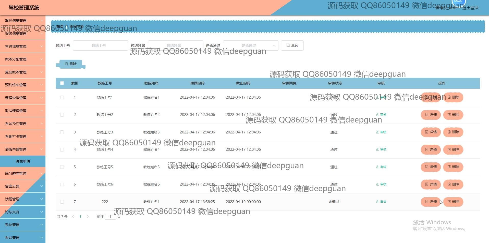
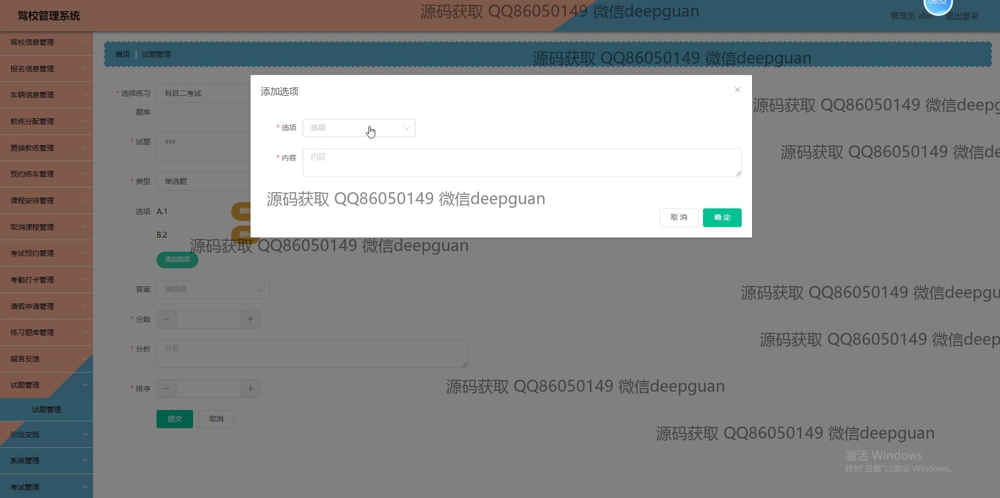

<h1 align="center">驾校管理系统</h1>

## 简介
驾校管理系统：基于Spring Boot开发，角色分为管理员、学员、教练；功能包括学员管理、教练管理、报名信息管理、课程安排、考勤管理、论坛交流及留言反馈，提升驾校管理效率。    --计算机毕业设计源码；毕设源码；java毕业设计源码

## 联系方式

<h3 align="center">获取完整代码与数据库文件 + 微信：deepguan QQ: 86050149 QQ群: 783742310</h3>

<h3 align="center">可帮忙远程部署 包运行成功！提供远程部署、修改代码、设计文档指导、代码讲解等服务！</h3>

## 功能介绍（完整见运行截图）
管理员：基本功能包括驾校信息管理、学员信息管理、教练管理、车辆管理和报名信息管理。系统提供用户注册、登录、角色选择与身份验证功能，并具备学员注册和学员信息录入与查询、教练管理、车辆信息管理、课程安排与考试预约等操作模块。支持留言反馈管理、论坛交流和后台系统管理，便于处理学员与教练的反馈沟通、公告发布以及系统管理等任务，确保系统稳定、高效运作。

学员：主要功能包括注册、登录及个人信息管理。可以通过系统查看和管理个人信息，如报名信息、课程安排、考试记录及练习题库。学员可通过系统报名课程、预定教练，并记录与查看考试计划和成绩。同时，系统提供交流论坛及留言反馈功能，便于学员与其他用户或管理员互动和反馈学习中遇到的困难，提升学习效率与体验。

教练：系统为教练提供课程安排管理、预约排程及考勤打卡管理，便于合理安排教学时间。教练可通过系统查看和管理学员信息，进行课程指导记录及学员请假管理。系统支持教练审核请求的管理模块，如更换教练审核，帮助教练与学员有效沟通，优化教学安排。同时，系统的论坛功能为教练提供了一个交流经验和公告发布的平台。

游客：游客可通过首页的导航栏浏览驾校的基本信息、课程安排以及相关公告。无需注册即可查看部分驾校信息及论坛交流模块的内容，了解驾校的各项功能和服务内容。注册后，游客可成为学员或其他角色，并享有相应角色的功能权限。

## 运行截图

本代码来源于网络,仅供学习参考使用!

